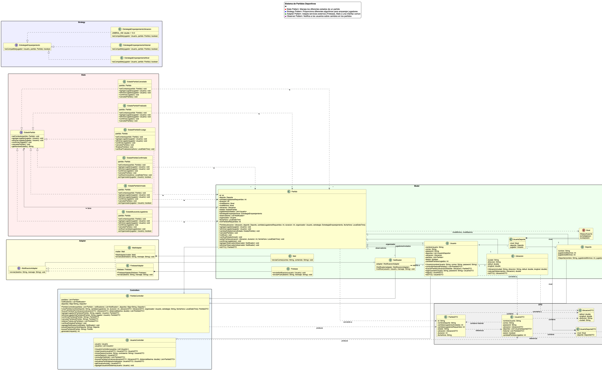

# Uno Más - Final Project (README in English 🇬🇧)

This project was developed as a Final Assignment for the course **Object-Oriented Analysis and Design** at **Universidad Argentina de la Empresa (UADE)**.  
The system, called **Uno Más**, enables users to manage and join sports matches to complete teams.

## 👥 Development Team

- Tomás Bermejo (Student ID: 1110048)  
- Juan Cruz Araki (Student ID: 1126144)  
- Agustín Chung (Student ID: 1141474)  
- Sebastián Porini (Student ID: 1144953)
- Franco Baltasar Massi (Student ID: 1156946)

## 📆 Delivery Date

- June 25, 2025

## 🎯 Project Objective

Build a system that allows users to:

- Register with location and sports preferences.
- Create and manage matches.
- Automatically assign players based on strategies.
- Manage match state transitions.
- Notify participants on changes.

## 🧩 Design Patterns Implemented

### 1. State
Handles the behavior of matches based on their current state:
- SearchingPlayersState
- AssembledState
- ConfirmedState
- InGameState
- FinishedState
- CancelledState

> Encapsulates state transitions and behaviors.

### 2. Strategy
Defines multiple matching algorithms:
- MatchByLevel
- MatchByHistory
- MatchByLocation

> Enables dynamic strategy switching.

### 3. Adapter
Unifies different notification services:
- FirebaseAdapter
- MailAdapter

> Supports easy integration of external APIs.

### 4. Observer
Players are notified when a match state changes.

> Decouples business logic from notification logic.

## 📌 Class Diagram

## 🛠️ Technologies Used

- **Java**  
- **IntelliJ IDEA**  
- **Lombok**  
- **Git**  

## 🧪 Key Features

- User registration, login, logout.
- Match creation and management.
- Smart player matching using strategies.
- Automatic state transitions.
- Notification system and match history.

### Contributions

This project was developed for the **Object-Oriented Analysis and Design** course as an academic document for the Computer Science program at UADE. Contributions to this repository are not open as it is an academic project. However, downloading and exploring the repository for educational purposes is permitted.

### License

This project is licensed for academic and non-commercial use only. Redistribution and use in source and binary forms, with or without modification, are permitted for educational purposes. Commercial use, distribution, or sublicensing is prohibited without explicit permission.

### Acknowledgments

We would like to thank **UADE** and the professor, **Matias Damian Stricagnoli**, for their guidance and support during the development of this project.

---

# Uno Más - Trabajo Práctico Obligatorio (README en español 🇦🇷)

Este proyecto fue desarrollado como Trabajo Práctico Obligatorio para la materia **Análisis y Diseño Orientado a Objetos** en la **Universidad Argentina de la Empresa (UADE)**.  
El sistema, llamado **Uno Más**, permite gestionar encuentros deportivos entre usuarios que buscan completar equipos para distintos deportes.

## 👥 Equipo de Desarrollo

- Tomás Bermejo (Legajo: 1110048)  
- Juan Cruz Araki (Legajo: 1126144)  
- Agustín Chung (Legajo: 1141474)  
- Sebastián Porini (Legajo: 1144953)
- Franco Baltasar Massi (Legajo: 1156946)

## 📆 Fecha de Entrega

- 25 de Junio de 2025

## 🎯 Objetivo del Proyecto

Desarrollar una aplicación que permita:

- Registro de usuarios con ubicación y deportes que practica.
- Creación y edición de partidos con lógica de emparejamiento.
- Gestión de estados del partido (buscando jugadores, confirmado, en juego, etc.).
- Notificación a los jugadores ante cambios.
- Emparejamiento automático mediante estrategias configurables.

## 🧩 Patrones de Diseño Utilizados

### 1. State
Para manejar el comportamiento de los partidos según su estado:
- `EstadoBuscandoJugadores`
- `EstadoPartidoArmado`
- `EstadoPartidoConfirmado`
- `EstadoPartidoEnJuego`
- `EstadoPartidoFinalizado`
- `EstadoPartidoCancelado`

> Permite respetar SRP y Open/Closed.

### 2. Strategy
Para definir distintas estrategias de emparejamiento:
- `EstrategiaEmparejamientoNivel`
- `EstrategiaEmparejamientoHistorial`
- `EstrategiaEmparejamientoUbicacion`

> Posibilita cambiar la estrategia en tiempo de ejecución.

### 3. Adapter
Para unificar diferentes mecanismos de notificación:
- `FirebaseAdapter`
- `MailAdapter`

> Permite trabajar con distintos servicios desacoplados.

### 4. Observer
Para notificar automáticamente a los jugadores ante cambios en el partido.

> Los jugadores son suscriptores del partido (observable).

## 📌 Diagrama de Clases

## 🛠️ Tecnologías Utilizadas

- **Java**  
- **IntelliJ IDEA**  
- **Lombok**  
- **Git**  

## 🧪 Funcionalidades Clave

- Registro, login y logout de usuarios.
- Creación, edición y cancelación de partidos.
- Emparejamiento inteligente según nivel, ubicación o historial.
- Gestión de estados automáticos.
- Historial y notificaciones.

### Contribuciones

Este proyecto fue desarrollado para la materia **Análisis y Diseño Orientado a Objetos** como un documento académico para el programa de Ingeniería en Informática en UADE. Las contribuciones a este repositorio no están abiertas, ya que se trata de un proyecto académico. Sin embargo, se permite descargar y explorar el repositorio con fines educativos.

### Licencia

Este proyecto está licenciado para uso académico y no comercial únicamente. La redistribución y el uso en formas de fuente y binario, con o sin modificaciones, están permitidos para fines educativos. Se prohíbe el uso comercial, distribución o sublicencia sin permiso explícito.

### Agradecimientos

Agradecemos a **UADE** y al profesor, **Matias Damian Stricagnoli**, por su guía y apoyo durante el desarrollo de este proyecto.
